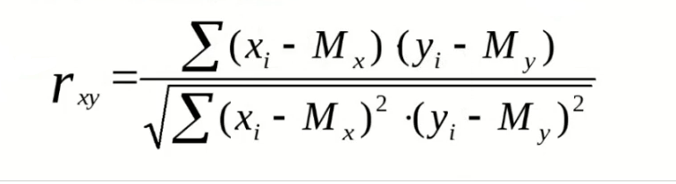

**Семинар 4. Функциональное программирование**

**Домашнее задание: Написать скрипт для расчета корреляции Пирсона между двумя случайными двумя случкайными величинами (массивами). Можете использовать люьую парадигму, но рекомендуется использовать функциональную.**

* Формула для расчета корреляции:

* Выполнение: 
[КОД](pearson_car.py)
* Комментарий: В написании кода я использовал процедурную и функциональную парадигмы